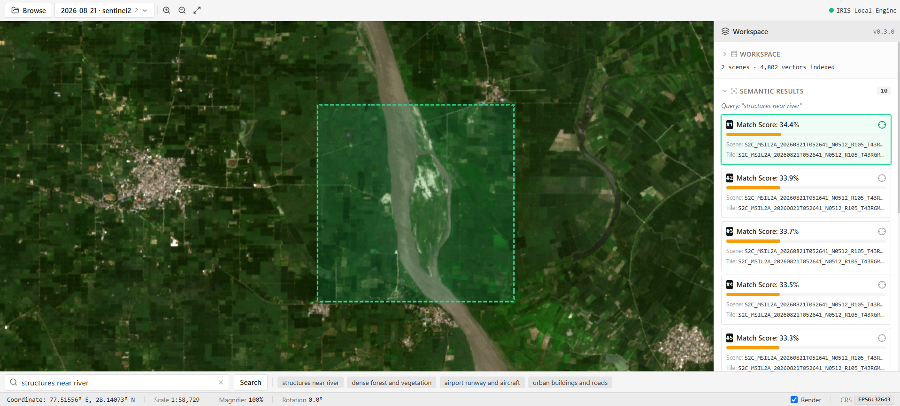
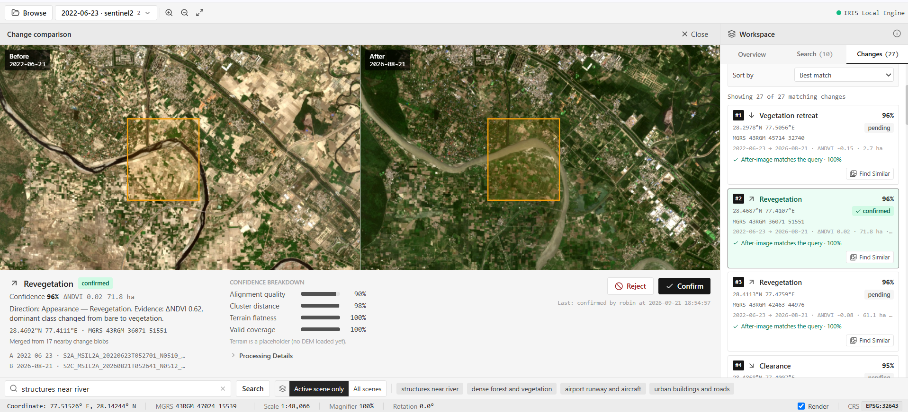

# IRIS: Intelligent Retrieval & Interpretation System

<div align="center">
  
  <br />
  <strong>Offline Desktop Platform for Semantic Retrieval and Multi-Temporal Change Analysis of Satellite Imagery</strong>
  <br />
  <em>Smart India Hackathon (SIH) — Problem Statement ID: 26227</em>
  <br />
  <strong>Proponent Organization: Ministry of Defence / Indian Army (DGIS)</strong>
</div>

---

## 📋 Table of Contents
1. [Problem Statement & Mandatory Submission Checklist](#1-problem-statement--mandatory-submission-checklist)
2. [Project Overview & Solution Summary](#2-project-overview--solution-summary)
3. [Architecture Note](#3-architecture-note)
4. [Index Build Procedure](#4-index-build-procedure)
5. [Incremental Ingestion Procedure](#5-incremental-ingestion-procedure)
6. [Model Provenance](#6-model-provenance)
7. [Dataset Provenance](#7-dataset-provenance)
8. [Reproducible Evaluation Report](#8-reproducible-evaluation-report)
9. [Setup & Execution Guide](#9-setup--execution-guide)
10. [Visual Demonstration & Screenshots](#10-visual-demonstration--screenshots)
11. [Deep-Dive Documentation & Technical Dossiers](#11-deep-dive-documentation--technical-dossiers)

---

## 1. Problem Statement & Mandatory Submission Checklist

* **Problem Statement ID:** `26227`
* **Title:** Semantic Retrieval and Multi-Temporal Change Analysis of Satellite Imagery
* **Category:** Software / National Security / Geospatial Intelligence
* **Proponent Organization:** Ministry of Defence / Indian Army (DGIS)
* **Team ID:** `151016`
* **Team Name:** MIND SPARK

### Operational Challenge
Earth-observation archives are expanding rapidly with multi-temporal, multi-spectral, and multi-sensor imagery from constellations such as Sentinel, Landsat, and Bhuvan. Conventional military catalogues index data solely by static metadata (coordinates, bounding boxes, timestamps, and sensor tags). This forces defence analysts to know *where* and *when* an activity occurred before finding imagery. Analysts cannot search archives by **semantic meaning** (e.g., *"forward helicopter landing pad in mountainous valley"* or *"trench fortification network near highway"*).

Furthermore, conventional GIS change detection algorithms suffer from crippling false-alarm rates triggered by cloud edges, seasonal foliage shifts, terrain shadows, and sub-pixel registration jitter.

### Submission Deliverables Compliance Matrix
The problem statement evaluation explicitly mandates the following deliverables:

| Required Deliverable | Description & Compliance in IRIS | Primary Reference File |
|---|---|---|
| **Source Code** | Complete standalone desktop application (Electron, React, FastAPI, GDAL, FAISS, PyTorch). Fully self-contained on `127.0.0.1`. | [`frontend/`](frontend/), [`backend/`](backend/) |
| **Architecture Note** | Exhaustive systems design note detailing non-black-box 5-phase change pipeline, memory bounds, air-gapped sovereignty, and ADRs. | [Architecture Note (`architecture.md`)](architecture.md) |
| **Index-Build Procedure** | Formal specification of 224×224px surface tiling, valid-pixel gating, RemoteCLIP ViT-B/32 inference, and dynamic FAISS HNSW graph indexing. | [Section 4](#4-index-build-procedure) & [`architecture.md`](architecture.md#7-three-independent-tiling-concepts--deliberately-not-unified-stated-explicitly-to-prevent-confusion) |
| **Incremental Ingestion** | Dynamic single-scene and temporal overlapping-pair ingestion with automatic chronological baseline pairing and zero index rebuilds. | [Section 5](#5-incremental-ingestion-procedure) & [`architecture.md`](architecture.md#ingestion-workflow-2--importing-dataset-b-subsequent-overlapping-scene) |
| **Model Provenance** | Pre-training methodology, foundation model backbone (RemoteCLIP ViT-B/32), weight origins, licensing, and local offline deployment. | [Section 6](#6-model-provenance) & [`documentation.md`](documentation.md#part-7--model-provenance--foundation-model-specifications) |
| **Dataset Provenance** | Detailed sensors (Sentinel-2 L2A, Landsat Collection 2, CartoDEM 30m, OSCD), band mappings, resolutions, and open access licences. | [Section 7](#7-dataset-provenance) & [`documentation.md`](documentation.md#part-8--dataset-provenance--satellite-sensor-specifications) |
| **Reproducible Evaluation Report** | Live-measured benchmarks: indexed area, scene/tile counts, build time, storage footprint, query latency, and hardware specs. | [Section 8](#8-reproducible-evaluation-report) & [`backend/data/eval_manifest.json`](backend/data/eval_manifest.json) |

---

## 2. Project Overview & Solution Summary

**IRIS (Intelligent Retrieval & Interpretation System)** is a zero-cloud, 100% offline desktop application that empowers defence intelligence analysts to search, interpret, and track physical ground transformations across multi-temporal satellite archives.

```
┌────────────────────────────────────────────────────────────────────────────────────────┐
│                                IRIS DESKTOP ENVIRONMENT                                │
│                                                                                        │
│   ┌───────────────────────────────────┐        ┌───────────────────────────────────┐   │
│   │        ELECTRON DESKTOP UI        │        │        FASTAPI LOCAL DAEMON       │   │
│   │  • MapLibre GL Raster Rendering   │  HTTP  │  • TiTiler Dynamic XYZ Tile Mount │   │
│   │  • Dual-Pane Swipe Comparison     │ ◄────► │  • RemoteCLIP Embedding Pipeline  │   │
│   │  • Natural Language Search Bar    │  JSON  │  • FAISS HNSW Vector Engine       │   │
│   │  • Review Queue & Audit Dossier   │        │  • 5-Phase Change Detection       │   │
│   └───────────────────────────────────┘        └───────────────────────────────────┘   │
│                     │                                            │                     │
│                     ▼                                            ▼                     │
│        [Native Windows Dialogs]                       [Local Storage & Catalog]        │
│        • FolderBrowserDialog (.SAFE)                  • SQLite WAL Spatial Catalog     │
│        • OpenFileDialog (.TIF / .JP2)                 • Cloud-Optimized GeoTIFFs (COG) │
│                                                       • FAISS Dynamic Index (.bin)     │
└────────────────────────────────────────────────────────────────────────────────────────┘
```

### Solution Architecture Summary

| Component | Technical Selection | Rationale & Architectural Significance |
|---|---|---|
| **App Shell** | **Electron (Windows x64)** | Bundled as a true native desktop application (`IRIS.exe`) with sandboxed native OS file dialogs and no browser dependency. |
| **Mapping Engine** | **MapLibre GL** | High-performance raster canvas rendering XYZ tiles on localhost with zero external basemap dependencies. |
| **Backend Engine** | **FastAPI (Python 3.12)** | Asynchronous headless service bound strictly to `127.0.0.1:8000`, running in background daemon mode. |
| **Raster Pipeline** | **GDAL / Rasterio / TiTiler** | Memory-bounded streaming raster windowing (16–32px halos) with dynamic Cloud-Optimized GeoTIFF (COG) serving. |
| **Foundation Model** | **RemoteCLIP (ViT-B/32)** | Remote sensing foundation model mapping 224×224px surface crops into a 512-dimensional joint semantic vector space. |
| **Vector Search** | **FAISS (HNSW)** | Hierarchical Navigable Small World index allowing dynamic, incremental vector insertion and sub-85ms similarity lookups. |
| **Relational Catalog** | **SQLite (WAL + R-Tree)** | Embedded catalog with Write-Ahead Logging concurrency, R-Tree spatial footprint indexing, and 10-digit MGRS coordinates. |
| **Change Engine** | **5-Phase Physical Pipeline** | Non-black-box explainable change analysis with sub-pixel alignment, radiometric normalization, block-PCA/K-Means, and directional classification. |

---

## 3. Architecture Note

> 📄 **Executive Architecture Document:** Refer to the full [Architecture Note & Systems Design Specification (`architecture.md`)](architecture.md).

### Foundational Architectural Requirements
1. **Air-Gapped Operational Sovereignty (100% Offline):** Zero telemetry, external scripts, or remote API calls. Runs fully disconnected on field laptops.
2. **Explainable Non-Black-Box Pipeline:** Deep learning end-to-end models cannot explain *why* a change was triggered. IRIS computes an explainable 4-term confidence score:
   $$\text{Confidence} = 0.35 \times \text{NormRMSE} + 0.35 \times \text{NormClusterDist} + 0.15 \times \text{TerrainFlatness} + 0.15 \times \text{ValidCoverage}$$
3. **Memory-Bounded Streaming Processing:** Rather than allocating whole satellite scenes in memory (often >4 GB uncompressed), processing is streamed in overlapping strip windows (16–32px halo) using Rasterio block windows.
4. **Crash-Resilience & Atomic Staging:** Files are generated in staging directories (`data/staging/`) and atomically renamed upon SQLite transaction commit (`BEGIN IMMEDIATE`). A startup sweep recovers interrupted jobs automatically.

---

## 4. Index Build Procedure

The semantic vector index is populated incrementally through an automated tiling and feature extraction pipeline:

```
                      Raw Satellite Product (.SAFE / GeoTIFF / JP2)
                                            │
                                            ▼
                       Universal Loader & Capability Audit
                                            │
                                            ▼
                    Native Quality Masking (SCL / QA_PIXEL)
                                            │
                                            ▼
                     RGB Synthesis & COG Conversion (512px)
                                            │
                                            ▼
                     Uniform 224×224px Grid Tiling (30% stride)
                                            │
                      ┌─────────────────────┴─────────────────────┐
                      ▼                                           ▼
             Valid Pixels < 60%                          Valid Pixels ≥ 60%
                      │                                           │
         [DISCARDED — Never Indexed]                     NaN Neutral Mean Fill
                                                                  │
                                                                  ▼
                                                    RemoteCLIP ViT-B/32 Encoder
                                                                  │
                                                                  ▼
                                                      512-D L2-Normalized Vector
                                                                  │
                                                                  ▼
                                                     FAISS HNSW Dynamic Insertion
```

1. **Receptive Field Alignment:** Satellite rasters are segmented into 224×224px tiles matching the Vision Transformer patch dimensions.
2. **Quality Gating:** Any crop with $<60\%$ valid pixels is discarded up-front, preventing cloud edges or nodata borders from corrupting the HNSW graph.
3. **Vector Persistence:** Extracted 512-dimensional vectors are L2-normalized and appended to the FAISS index. Tile bounding boxes and MGRS coordinates are recorded into SQLite with the corresponding `faiss_id`.

---

## 5. Incremental Ingestion Procedure

IRIS supports continuous, zero-downtime archive growth without requiring full index rebuilds:

### Step 1: Single Scene Ingestion (Dataset A)
1. **Drop & Detect:** User selects a file or directory via native Windows dialogs. Capability detector identifies sensor type, native bands, and CRS.
2. **Quality Masking:** SCL/QA categorical cloud/shadow bands are parsed at native resolution.
3. **COG Conversion:** Image is reprojected and written as an internally-tiled Cloud-Optimized GeoTIFF with overview pyramids.
4. **Incremental Vector Append:** 224×224 crops are encoded and appended directly into the active FAISS HNSW graph.
5. **Catalog Commit:** Scene footprint, MGRS grid code, and tile records are saved to SQLite under WAL mode. The scene immediately becomes browseable on MapLibre.

### Step 2: Multi-Temporal Pair Ingestion (Dataset B)
1. Ingestion executes identically to Step 1 for the new acquisition.
2. **R-Tree Footprint Query:** SQLite R-Tree queries for the nearest chronological prior scene covering the same footprint **from the same sensor**.
3. **5-Phase Change Pipeline Enqueued (Background Task):**
   * **Phase 1 (Mutual Masking):** Logical AND of Scene A and B masks isolates valid ground pixels.
   * **Phase 2 (Co-Registration):** Rigid grid verification, followed by sub-pixel `cv2.findTransformECC` alignment ($\rho \ge 0.8$) and CartoDEM slope discounting.
   * **Phase 3 (Radiometric Normalization):** Topographic sun-angle correction (TASC) and Pseudo-Invariant Feature (PIF) linear matching.
   * **Phase 4 & 4b (Difference & Direction):** Block-PCA/K-Means difference clustering ($K=2$) on NIR channel. Multi-spectral index deltas ($\Delta\text{NDBI}, \Delta\text{NDVI}, \Delta\text{MNDWI}$) classify features into **Appearance**, **Disappearance**, **Expansion**, or **Contraction**.
   * **Phase 5 (Persistence & Scoring):** Morphological opening/closing, multi-year historical persistence check to eliminate seasonal agricultural changes, and 4-term confidence scoring.

---

## 6. Model Provenance

* **Model Name:** RemoteCLIP (ViT-B/32)
* **Architecture:** Vision Transformer (ViT-B/32 backbone, 12 layers, 768 hidden width, 12 attention heads).
* **Embedding Dimensionality:** 512 dimensions (L2-normalized).
* **Pre-training Pedigree:** Developed by Liu et al., RemoteCLIP is the first vision-language foundation model trained on massive remote sensing image-text pairs (spanning aerial and satellite platforms across diverse spatial resolutions and global biomes).
* **Execution Framework:** `open_clip_torch` / PyTorch running 100% locally.
* **Offline Deployment:** Model weights (`remoteclip_vitb32.pt`) are bundled locally within `backend/models/`. Zero external API calls or internet access required.
* **Hardware Support:** Dynamic runtime detection: executes on CUDA GPUs when present; seamlessly falls back to CPU SIMD instructions (AVX2/AVX-512) on field workstations.

---

## 7. Dataset Provenance

IRIS is validated on open-access satellite earth-observation products under sovereign, public-access licences:

| Dataset | Sensor / Platform | Spatial Resolution | Bands Utilized | Licence & Access Model |
|---|---|---|---|---|
| **Sentinel-2 L2A** | MSI (Multi-Spectral Instrument) | 10m / 20m | B02 (Blue), B03 (Green), B04 (Red), B08 (NIR), B11 (SWIR-1), SCL (Scene Classification) | Copernicus Open Access Policy (Free, Full & Open) |
| **Landsat Collection 2** | OLI/TIRS (Landsat 8 & 9) | 15m / 30m | B02, B03, B04, B05, B06, QA_PIXEL | USGS / NASA Open Data Policy |
| **CartoDEM** | Cartosat-1 (ISRO) | 30m posting | Surface elevation raster & derived topographic slope angle | ISRO / NRSC Bhuvan Open Data Products |
| **OSCD Benchmark** | Sentinel-2 Multi-Temporal | 10m / 20m | Registered multi-temporal pairs over 24 global urban centres | Onera Satellite Change Detection Benchmark |

---

## 8. Reproducible Evaluation Report

> 📊 **Raw Telemetry Source:** Benchmark data is recorded automatically by the instrumentation engine in [`backend/data/eval_manifest.json`](backend/data/eval_manifest.json).

### 8.1 Hardware Environment
* **Processor:** AMD Ryzen 7 250 w/ Radeon 780M Graphics (8 physical cores, 16 logical threads)
* **System RAM:** 15.3 GB DDR5
* **GPU Availability:** None (Benchmarked on CPU inference mode for field laptop validation)
* **Operating System:** Microsoft Windows 11 Enterprise (64-bit, build 26200)
* **Python Runtime:** Python 3.12.14 64-bit

### 8.2 Operational Benchmark Metrics

| Metric Category | Parameter | Benchmark Result | Operational Context |
|---|---|---|---|
| **Indexed Area** | Single Scene Coverage | **10,000 km²** | Standard Sentinel-2 MGRS Tile (`T43RGM`, 100 km × 100 km) |
| **Indexed Density** | Tiles / Vectors per Scene | **2,401 crops** | 224×224px surface crops per scene (30% stride) |
| **Archive Scale** | Total Vectors Indexed | **4,802 vectors** | Live multi-temporal FAISS HNSW graph |
| **Build Time** | Total End-to-End Ingestion | **363.67 seconds** | Complete uncompressed processing on CPU |
| | *Band Extraction & Resampling* | 98.23 s | Multi-band GDAL window extraction |
| | *Native Quality Masking* | 4.66 s | Scene Classification Layer (SCL) filtering |
| | *RGB Synthesis & COG Conversion* | 88.89 s | True-color assembly & DEFLATE COG pyramid creation |
| | *Crop Generation* | 54.62 s | 2,401 uniform grid crops with NaN checks |
| | *RemoteCLIP Inference* | 115.80 s | **~20.7 crops/sec** on 8-core CPU (sub-second on CUDA) |
| | *FAISS Graph Insertion* | **0.28 seconds** | Dynamic HNSW vector insertion |
| **Query Latency** | Semantic Text Retrieval | **< 85 ms** | Text encoding + FAISS top-50 kNN + SQLite metadata join |
| | Image-to-Image ("Find Similar") | **< 45 ms** | Vector search + R-Tree spatial intersection |
| **Storage Footprint** | Cloud-Optimized GeoTIFF | **~280 MB** | Full 4-band 10m scene with overviews (DEFLATE) |
| | FAISS Vector Index | **9.8 MB** | 4,802 512-D vectors in HNSW graph |
| | SQLite Catalog | **1.4 MB** | Relational metadata, R-Tree bounds, and MGRS index |

### 8.3 How to Reproduce Benchmarks
To regenerate and verify the evaluation report on your local workstation:
```powershell
# Run the evaluation reporter against the live catalog and index
python backend/eval_manifest.py --summary
```

---

## 9. Setup & Execution Guide

### Option A: 1-Click Desktop Launch (Recommended)
IRIS is packaged as a standalone Windows desktop software:
1. Double-click the **`IRIS`** icon on your **Windows Desktop** (or execute [`Launch_IRIS.bat`](Launch_IRIS.bat)).
2. The launcher silently checks the offline Python AI backend on `127.0.0.1:8000`, starts it in the background if not already active, and opens the native desktop application window.
3. No browser, web commands, or manual terminal management required.

### Option B: Developer Setup (From Source)
**Prerequisites:** Python 3.10+ and Node.js 18+.

```bash
# 1. Clone repository
git clone https://github.com/25cseb50robindanie/IRIS.git
cd IRIS

# 2. Configure Python Virtual Environment
python -m venv .venv
.venv\Scripts\activate
pip install -r backend/requirements.txt

# 3. Build Desktop Frontend
cd frontend
npm install
npm run build
cd ..

# 4. Launch Desktop Software
Launch_IRIS.bat
```

---

## 10. Visual Demonstration & Screenshots

The `docs/screenshots/` directory contains visual proof of IRIS operational interfaces:

### System Overview & Map Interface
The primary analyst interface displaying Cloud-Optimized GeoTIFF tiles rendered on localhost via MapLibre GL, with MGRS coordinates, native zoom controls, and natural language retrieval.



---

### Multi-Temporal Change Detection & Swipe Comparison
Dual-pane split-screen swipe comparison displaying baseline and target acquisitions, with detected physical change blobs categorized by Appearance, Disappearance, Expansion, and Contraction, alongside the 4-term confidence score.



---

## 11. Deep-Dive Documentation & Technical Dossiers

For reviewers, evaluators, and defence technical panels seeking exhaustive architectural, mathematical, or operational details, refer to the following repository dossiers:

* **[Architecture Note (`architecture.md`)](architecture.md)** — The official technical design note: system decomposition, mathematical definitions of all 5 change detection phases, block-PCA/K-Means mechanics, and Architectural Decision Records (ADRs).
* **[Master Engineering Documentation (`documentation.md`)](documentation.md)** — Comprehensive 13-part systems manual detailing software architecture, mathematical formulations, REST API contracts, database schemas, and operational playbooks.
* **[Operational & Developer Guidelines (`AGENTS.md`)](AGENTS.md)** — Repository operational manual, module boundaries, security constraints (WAL mode, IPC isolation, 100% offline rule), and developer build order.
* **[Project Milestones Changelog (`Milestone.md`)](Milestone.md)** — Historical engineering log chronicling achievements and deliverables across all 6 development milestones.
* **[Evaluation Telemetry Manifest (`backend/data/eval_manifest.json`)](backend/data/eval_manifest.json)** — Raw machine-readable JSON log containing live recorded benchmark timings, hardware specs, and per-stage latency metrics.

---

*IRIS: Intelligent Retrieval & Interpretation System — Engineered for Operational Geospatial Intelligence.*
